# BOOKORA_FINAL Filesystem Graph

```mermaid
flowchart TD
    root[BOOKORA_FINAL]

    root --> app_py[app.py]
    root --> db_schema[database_schema.sql]
    root --> firebase_credentials[firebase-credentials.json]
    root --> movies_data[movies-data.json]
    root --> requirements[requirements.txt]
    root --> seed_movies[seed_movies.py]
    root --> seed_shows[seed_shows.py]
    root --> gitignore[.gitignore]

    root --> docs_folder[docs/]
    root --> static_folder[static/]
    root --> templates_folder[templates/]

    subgraph Docs
        docs_folder --> readme_01[01_PROJECT_FOUNDATION.md]
        docs_folder --> readme_02[02_AUTH_LOGIN_SIGNUP.md]
        docs_folder --> readme_booking[BOOKING_FLOW_EXPLAINED.md]
        docs_folder --> readme_db[DATABASE_UNDERSTANDING.md]
        docs_folder --> readme_gmail[gmail_otp_understanding.md]
        docs_folder --> readme_otp[otp_understanding.md]
        docs_folder --> readme_seed[SEED_SHOWS_MATH_EXPLANATION.md]
        docs_folder --> readme_tech[TECHNOLOGIES_USED.md]
        docs_folder --> readme_graph[FILESYSTEM_GRAPH.md]
    end

    subgraph Static
        static_folder --> static_styles[styles.css]
        static_folder --> static_signin_js[signin-modal.js]
        static_folder --> static_signin_css[signin-modal.css]
        static_folder --> static_shows_css[shows-styles.css]
        static_folder --> static_shows_js[shows-script.js]
        static_folder --> static_seat_css[seat-selection-styles.css]
        static_folder --> static_seat_js[seat-selection-script.js]
        static_folder --> static_script[script.js]
        static_folder --> static_saved_js[saved-movies-script.js]
        static_folder --> static_profile_css[profile-styles.css]
        static_folder --> static_profile_js[profile-script.js]
        static_folder --> static_profile_completion_css[profile-completion.css]
        static_folder --> static_profile_completion_styles[profile-completion-styles.css]
        static_folder --> static_movie_details_js[movie-details-script.js]
        static_folder --> static_movie_details_css[movie-details-styles.css]
        static_folder --> static_my_bookings_js[my-bookings-script.js]
        static_folder --> static_my_bookings_css[my-bookings-styles.css]
        static_folder --> static_firebase_config[firebase-config.js]
        static_folder --> static_firebase_phone_auth[firebase-phone-auth.js]

        static_folder --> banners_folder[banners/]
        static_folder --> posters_folder[posters/]

        subgraph Banners
            banners_folder --> banner_war2[war-2-banner.jpg]
            banners_folder --> banner_dhurandar[dhurandar-banner.jfif]
            banners_folder --> banner_dil_dosti[dil-dosti-aur-dogs-banner.jfif]
            banners_folder --> banner_housefull5[housefull-5-banner.jfif]
            banners_folder --> banner_kesari2[kesari-chapter-2-banner.jfif]
            banners_folder --> banner_sikandar[sikandar-banner.jfif]
            banners_folder --> banner_sitaare[sitaare-zameen-par-banner.jfif]
            banners_folder --> banner_son_of_sardar2[son-of-sardar-2-banner.jfif]
            banners_folder --> banner_jolly[jolly-llb-3-banner.jpg]
            banners_folder --> banner_border2[border-2-banner.jpg]
            banners_folder --> banner_baaghi4[baaghi-4-banner.webp]
        end

        subgraph Posters
            posters_folder --> poster_war2[War-2-poster.jpg]
            posters_folder --> poster_dhurandhar[dhurandhar-poster.jpg]
            posters_folder --> poster_son_of_sardaar2[Son-of-Sardaar-2-poster.jpg]
            posters_folder --> poster_chhaava[Chhaava-poster.jpg]
            posters_folder --> poster_sitaare[Sitaare-Zameen-Par-poster.jpg]
            posters_folder --> poster_border2[border2-poster.webp]
            posters_folder --> poster_sikandar[Sikandar-poster.jpg]
            posters_folder --> poster_baaghi4[Baaghi-4-poster.jpg]
            posters_folder --> poster_kesari2[Kesari-Chapter-2-poster.jpg]
            posters_folder --> poster_jolly[Jolly-LLB-3-poster.jpg]
            posters_folder --> poster_housefull5[Housefull-5-poster.jpg]
            posters_folder --> poster_dil_dosti[Dil-Dosti-Aur-Dogs-poster.jpg]
        end
    end

    subgraph Templates
        templates_folder --> tpl_index[index.html]
        templates_folder --> tpl_movie_details[movie-details.html]
        templates_folder --> tpl_my_bookings[my-bookings.html]
        templates_folder --> tpl_navbar[navbar.html]
        templates_folder --> tpl_profile[profile.html]
        templates_folder --> tpl_saved_movies[saved-movies.html]
        templates_folder --> tpl_seat_selection[seat-selection.html]
        templates_folder --> tpl_shows[shows.html]
    end
```

## File Count Snapshot
- Root files: 8
- Docs files: 9
- Static files: 19
- Banner assets: 11
- Poster assets: 12
- Template files: 8

This graph includes every file currently present in the project tree under `BOOKORA_FINAL/`.